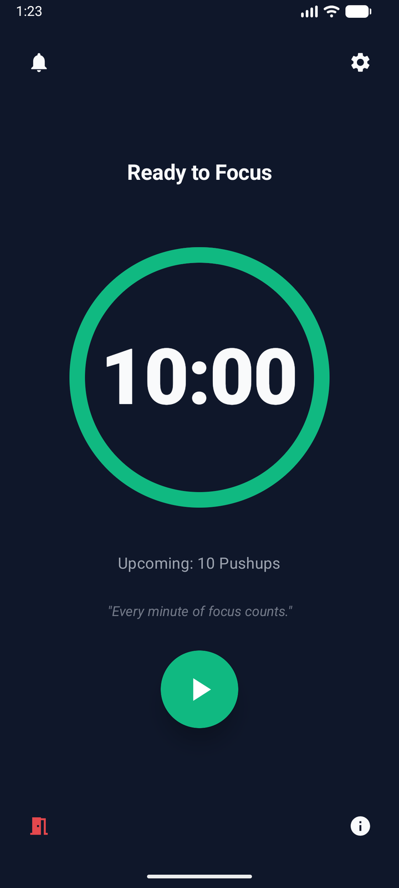
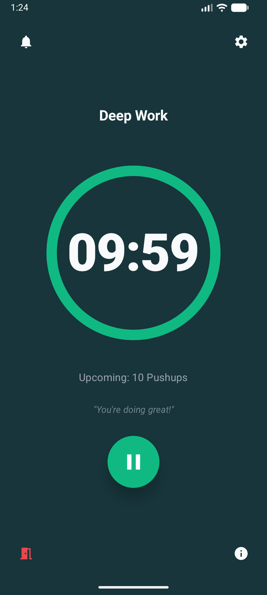
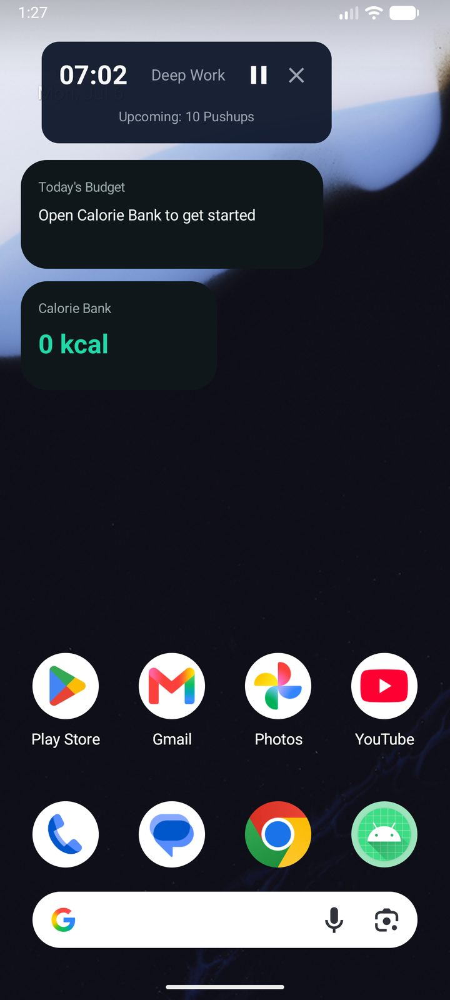
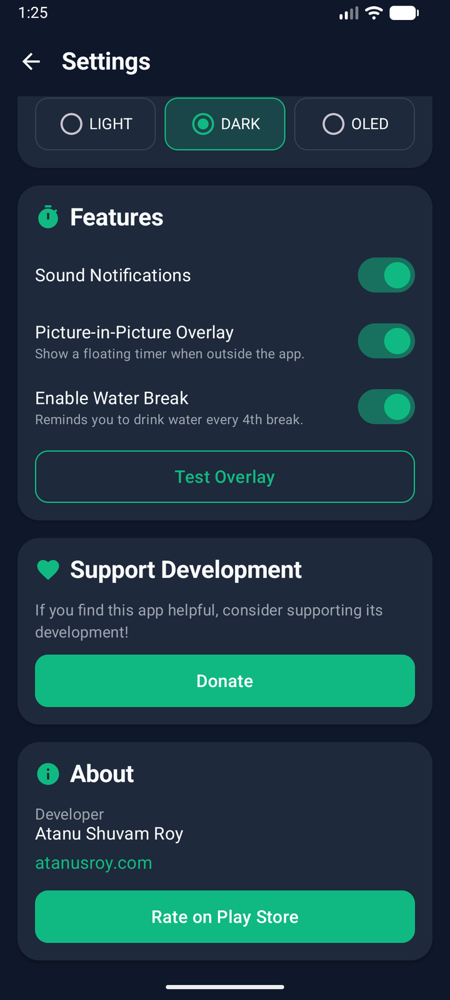
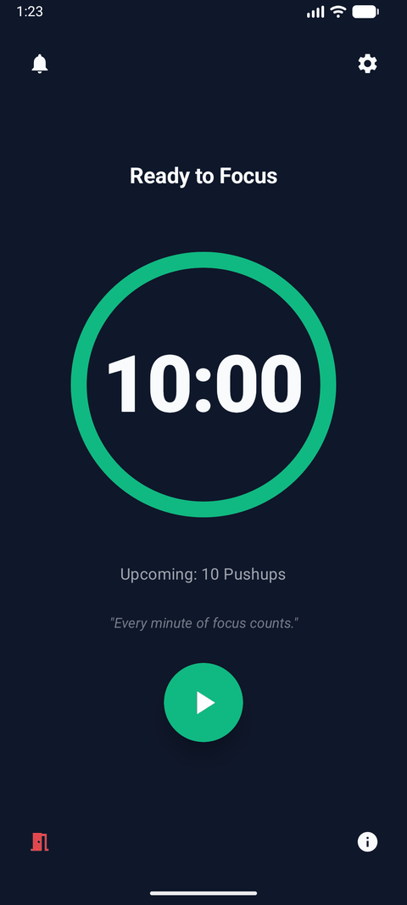

<div align="center">
  
  <h1>Get Up</h1>
  <p><strong>Stay Active. Stay Focused. Stay Healthy.</strong></p>
  <p>A smart productivity timer designed to keep you moving, hydrated, and at your peak performance throughout the workday.</p>
  <p>
    
  </p>
</div>

<br />

## 📸 Screenshots

<div align="center">
  
  
  
  
</div>

<br />

## 🎬 Demo

<div align="center">
  
</div>

More screenshots and the full landing page live in [docs/index.html](docs/index.html).

## 🌟 About

**Get Up** is a native Android application built in Kotlin that acts as your personal well-being companion. It tackles the sedentary lifestyle of modern work environments by enforcing customizable micro-breaks for stretching, exercising, and hydration.

## ✨ Features

- **⏱️ Smart Timer Cycles**: Customizable work intervals and exercise windows.
- **🏃 Micro-Workouts**: Built-in, trackable exercises (Pushups, Stretching, etc.) to get your blood flowing.
- **💧 Hydration Tracking**: Scheduled reminders to drink water and maintain your energy levels.
- **🔔 Intelligent Alerts**: High-priority notifications and immersive overlay screens ensure you never miss a break.
- **📱 Beautiful Widgets**: Includes standard, large, small, and tiny Android widgets to track your timer right from the home screen.
- **🌙 Theming**: Sleek Dark Mode and OLED-friendly Pure Black mode.
- **📳 Feedback Modes**: Seamlessly toggle between ring modes and silent hardware vibration feedback.
- **📊 Statistics Tracking**: Keeps track of your completed and skipped tasks to help you build better habits.

## 🛠️ Tech Stack

- **Language**: Kotlin
- **UI Toolkit**: Jetpack Compose (Modern Declarative UI)
- **Architecture**: MVVM with Coroutines & StateFlow
- **Background Work**: Foreground Services for precise timer execution
- **Storage**: SharedPreferences with Kotlin Serialization
- **Widgets**: Jetpack Glance / AppWidgetProvider

## 🚀 Getting Started

### Prerequisites
- Android Studio Ladybug (or newer)
- Android SDK 34
- JDK 17+

### Installation
1. Clone the repository:
   ```bash
   git clone https://github.com/atanuroy911/getup-kotlin.git
   ```
2. Open the project in Android Studio.
3. Sync Gradle and build the project.
4. Run on a physical device or emulator (Android 8.0+ required, Android 12+ recommended).

## 📄 Privacy Policy & Terms

We respect your privacy. Get Up is designed to keep you healthy, not to mine your data — everything is stored locally on your device, with no ads or trackers. View our complete [Privacy Policy](docs/privacy-policy.html) and [Terms & Conditions](docs/terms-and-conditions.html) for more details.

---
<div align="center">
  <p>Built with ❤️ by Atanu Shuvam Roy</p>
</div>
